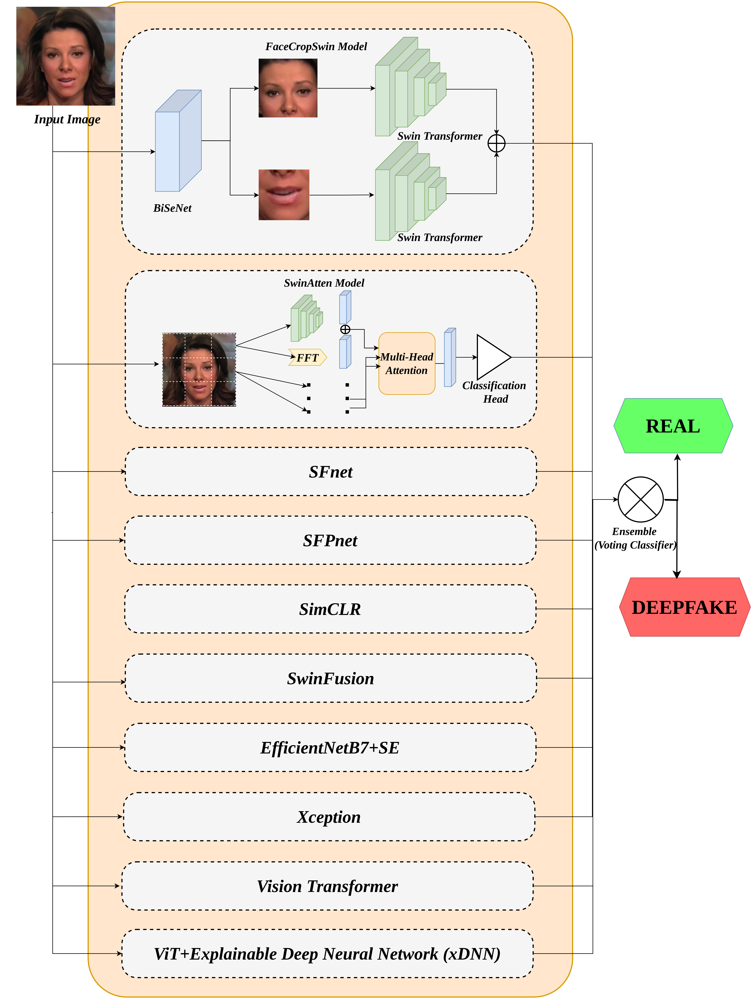
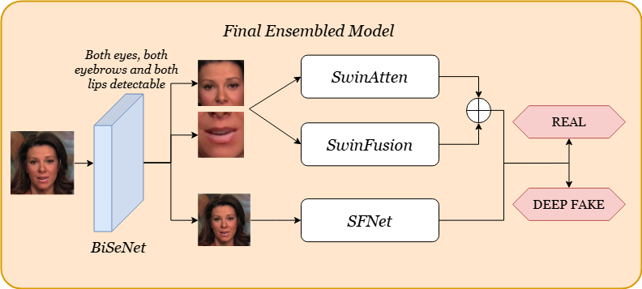
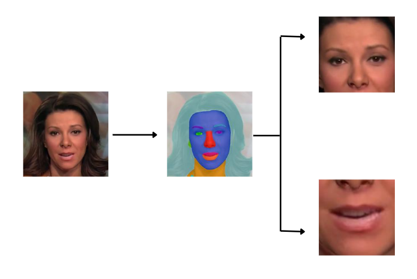
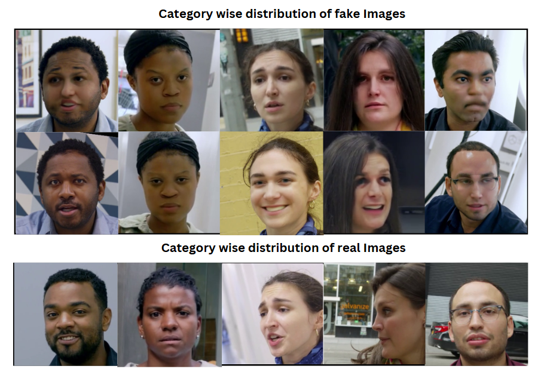

# 🧠 SFANet: Spatial-Frequency Attention Network for Deepfake Detection

<p align="center">
  
</p>

## 📘 Overview

**SFANet** introduces a **Spatial-Frequency Attention Network** designed to detect deepfakes by combining the strengths of **Transformer-based architectures** and **texture/frequency-based methods**.  
It leverages **spatial-frequency attention**, **face segmentation**, **data clustering**, and **sequential training** to achieve **state-of-the-art performance** on the **DFWild-Cup dataset** — a challenging blend of eight deepfake datasets.

---

## 🏗️ Architecture

The proposed ensemble combines:
- **Swin Transformer** and **Vision Transformer (ViT)** for global and local feature extraction.
- **SFNet / SFPNet / SwinAtten** for spatial-frequency fusion.
- **BiSeNet** for face segmentation and region-aware processing.
- **SwinFusion** for multi-cluster sequential training.

<p align="center">
  
</p>

---

## 🚀 Key Contributions

- 🧩 **Spatial-Frequency Fusion:** Integrates features from spatial and frequency domains using FFT-based attention.
- 🔍 **Region-based Focus:** Uses **BiSeNet** to identify high-impact facial regions (eyes, lips) for precise analysis.
- 🧠 **Hybrid Ensemble:** Combines Swin Transformer, ViT, EfficientNet, and Xception pipelines.
- ⚖️ **Sequential Training:** Addresses dataset imbalance via fake-data clustering and incremental learning.
- 💡 **Robust Generalization:** Demonstrates strong cross-dataset performance on unseen manipulations.

---

## 📊 Results

| Model | AUC | Accuracy | F1 | Precision | Recall | EER | DCF |
|-------|------|-----------|------|-----------|---------|------|------|
| SwinFusion | **0.9814** | **94.04%** | 0.941 | 0.924 | 0.959 | 0.0478 | 0.0586 |
| SwinAtten | 0.9799 | 93.72% | 0.937 | 0.926 | 0.949 | 0.0627 | 0.0624 |
| SFNet | 0.9807 | 93.49% | 0.934 | 0.934 | 0.935 | 0.0659 | 0.0656 |

**Final Ensemble Performance:**

| Metric | Value |
|--------|--------|
| AUC | **0.9822** |
| Accuracy | **0.9613** |
| F1-Score | **0.9609** |
| EER | **0.0388** |
| DCF | **0.0391** |

---

## 🧩 Methodology Overview

### 1. Data Processing
- Dataset: **8 public deepfake datasets**
- Resized: `256×256`
- Class Balance: Real : Fake = 1 : 5.14  
- Techniques:
  - Human-feature segmentation (emotion/race)
  - Fake data clustering (K-Means)
  - Face segmentation via **BiSeNet**

### 2. Model Components
- **SFNet** – Combines FFT + Swin Transformer for hybrid spatial-frequency learning  
- **SFPNet** – Patch-level frequency modeling  
- **SwinAtten** – Multi-head attention fusion of spatial & frequency domains  
- **SwinFusion** – Sequential training on fake clusters  
- **FaceCropSwin** – Eye and mouth-focused segmentation-based learning

<p align="center">
  
</p>

---

## ⚙️ Implementation Details

- **Framework:** PyTorch  
- **Pretrained Models:** TIMM Library  
- **Hardware:** NVIDIA A100 (40GB)  
- **Loss Function:** Binary Cross-Entropy  
- **Optimizer:** Adam  
- **Evaluation Metrics:** Accuracy, F1, AUC, EER, DCF  

---

## 📦 Installation

```bash
git clone https://github.com/<your-username>/SFANet.git
cd SFANet
pip install -r requirements.txt
````

---

## 🧪 Usage

### 1. Train Model

```bash
python train.py --config configs/sfanet.yaml
```

### 2. Evaluate

```bash
python evaluate.py --weights checkpoints/sfanet_best.pth
```

### 3. Run Inference

```bash
python predict.py --image path/to/image.jpg
```

---

## 📁 Repository Structure

```
SFANet/
│
├── configs/                 # YAML configs for models
├── datasets/                # Dataset preparation scripts
├── models/                  # Model definitions (SFNet, SwinAtten, etc.)
├── scripts/                 # Training and evaluation utilities
├── assets/                  # Architecture diagrams & figures
├── results/                 # Evaluation outputs and logs
├── train.py
├── evaluate.py
├── predict.py
└── README.md
```

---

## 🧑‍💻 Authors

**Vrushank Ahire**, **Aniruddh Muley**, **Shivam Zample**,
**Siddharth Verma**, **Pranav Menon**, **Abhinav Dhall (Supervisor)**
Indian Institute of Technology Ropar, Punjab, India
Monash University, Melbourne, Australia

---

## 📄 Citation

If you find this work useful, please cite:

```bibtex
@article{ahire2025sfanet,
  title={SFANet: Spatial-Frequency Attention Network for Deepfake Detection},
  author={Ahire, Vrushank and Muley, Aniruddh and Zample, Shivam and Verma, Siddharth and Menon, Pranav and Dhall, Abhinav},
  journal={IEEE SPCUP 2025},
  year={2025}
}
```

---

## 🖼️ Gallery

<p align="center">
  
  
</p>

---

## 📬 Contact

For queries or collaboration:
📧 [2022csb1002@iitrpr.ac.in](mailto:2022csb1002@iitrpr.ac.in) | 🌐 [IIT Ropar CSE](https://www.iitrpr.ac.in/cse)

---

## ⭐ Acknowledgements

We thank:

* **IEEE SPCUP 2025 Organizers**
* **Monash University – Faculty of IT**
* **IIT Ropar – Department of CSE**

---

**MIT License** © 2025 IIT Ropar – Deepfake Detection Team
